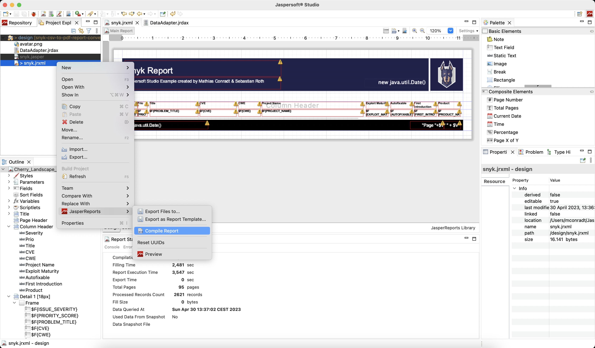

# Snyk CSV-to-PDF Report Converter

### Disclaimer

:warning: This project is not an official Snyk offering and not officially supported by Snyk.
Use at your own risk.

## Description 

PoC to showcase how we envision a performant pdf report generation:
- fast performing 
  - 400 issues report: 2 seconds (on Mac Book Pro)
  - 2600 issues report: 4 seconds (on Mac Book Pro)
  - 100.000 issues report: 30 seconds (on Mac Book Pro)
- proper page breaks
- page numbers
- using a report/template engine (Jasper Reports)

It takes a CSV file in (manually downloaded from Snyk New Reporting UI), and generates a PDF file based on it.

You can find two sample PDF reports under
- [/samples/small.pdf](/samples/small.pdf)
- [/samples/medium.pdf](/samples/medium.pdf)


## Build
```
mvn install
```

The build creates a fat jar with all dependencies included.

## Usage
```
java -jar snyk-csv-to-pdf-x.y-jar-with-dependencies.jar </path/to/csv/file.csv>
```

Example:
```
mvn install
java -jar target/snyk-csv-to-pdf-1.0-jar-with-dependencies.jar samples/small.csv
```

## Docker

### Build
```
mvn install
docker build -t snyk-csv-to-pdf .
```

### Run
```
docker run -v $(PWD)/samples:/data/ snyk-csv-to-pdf /data/medium.csv
```

If you don't want to build the project yourself but just quickly want to convert an existing csv file, use the pre-built image:

```
docker run -v $(PWD)/samples:/data/ mathiasconradt/snyk-csv-to-pdf /data/medium.csv
```

## Report Template Design

If you want to adjust the report template (snyk.jrxml), you can download the Jaspersoft Studio Community Edition from https://community.jaspersoft.com/project/jaspersoft-studio/releases

Open the `/design/snyk.jrxml` and for testing with sample data, adjust the path to the CSV file in the data adapter (`/design/DataAdapter.jrdax`) to point to the right path on your local machine.
You can use `/samples/small.csv` as a sample CSV file.

When done editing the template, make sure to compile it to `snyk.jasper` (right-click on `snyk.jrxml` > JasperReports > Compile Report).



## Contact

- Mathias Conradt ([@mathiasconradt](https://github.com/mathiasconradt))
- Sebastian Roth ([@ened](https://github.com/ened))
